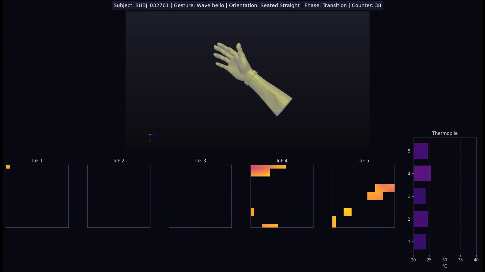

# Helios Data Visualizer

A tool for rendering sensor data from the _Helios_ device, as provided in the [CMI - Detect Behavior with Sensor Data](https://www.kaggle.com/competitions/cmi-detect-behavior-with-sensor-data) competition featured on Kaggle. A discussion post for the tool can be found [here](https://www.kaggle.com/competitions/cmi-detect-behavior-with-sensor-data/discussion/583118). 

The visualizer retrieves all sequences from the dataset that match the given filters. A video file (.mp4) is then produced for the sequence at the index specified by ```--sequence_index``` (default is 0, the first match).

**Example Video Frame:** 



> Watch an [example video](https://www.youtube.com/watch?v=UgHp7ph_c3E) (YouTube)


### Installation:

1. Create a python virtual environment (recommended)

2. Install dependencies: ```pip install -r requirements.txt```

3. Install FFmpeg (required for video generation):
   - Windows: Download from https://ffmpeg.org/download.html and add to PATH
   - macOS: ```brew install ffmpeg```
   - Linux: ```sudo apt install ffmpeg```


### Example Usage

Render the first sequence found in the dataset:

```
python helios_render.py --csv cmi-detect-behavior-with-sensor-data/train.csv
```

Render all "Wave hello" gestures for subject SUBJ_032761:

```
python helios_render.py --csv cmi-detect-behavior-with-sensor-data/train.csv --subject SUBJ_032761 --gesture "Wave hello"
```

Render the 4th "Neck - pinch skin" gesture for subject SUBJ_032761:

```
python helios_render.py --csv cmi-detect-behavior-with-sensor-data/train.csv --subject SUBJ_032761 --gesture "Neck - pinch skin" --sequence_index 3
```


### Arguments


| Argument | Required | Usage |
| ----- | ----- | ----- |
| ```--csv``` | ✅ | Path to the CSV data file  |
| ```--subject``` |  | Subject ID to filter (e.g., SUBJ_059520)  |
| ```--gesture``` |  | Gesture description to filter  |
| ```--behavior``` |  | Behavior description to filter  |
| ```--phase``` |  | Phase to filter |
| ```--orientation``` |  | Orientation to filter  |
| ```--output_dir``` |  | Output directory for videos  |
| ```--framerate``` |  | Frame rate for output video  |
| ```--sequence_index``` |  | Index of the sequence to render (if multiple sequences match)  |
| ```--no-cache``` |  | Disable parquet caching  |

